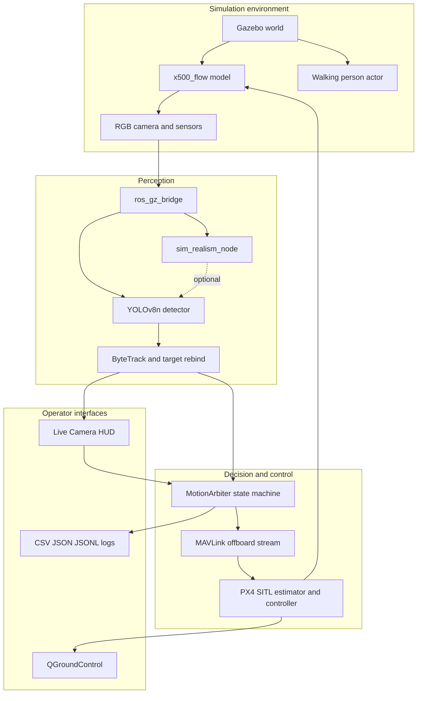
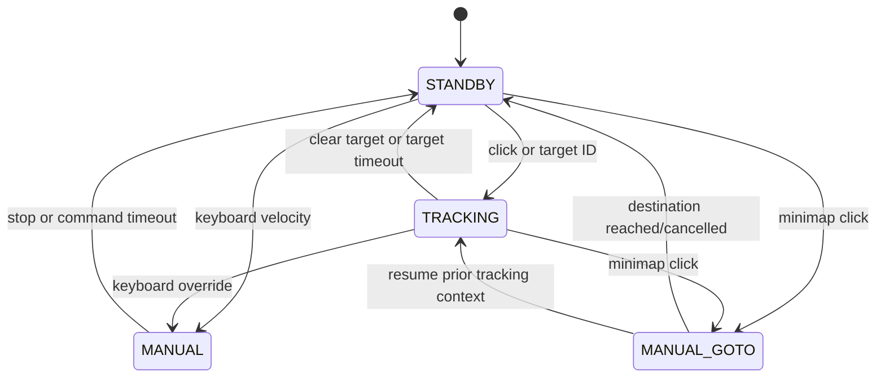

# Báo cáo dự án UAV Vision Tracking & Autonomous Follower

**Phiên bản báo cáo:** 1.0  
**Ngày tổng hợp:** 09/09/2026  
**Repository:** [PhamNguyenThanhTung/drone-project](https://github.com/PhamNguyenThanhTung/drone-project)  
**Giai đoạn:** Nghiên cứu, tích hợp và kiểm thử SITL  
**Mức sẵn sàng hiện tại:** Chưa phê duyệt cho bay thật

## 1. Tóm tắt điều hành

Dự án xây dựng một hệ thống drone tự động bám theo người bằng camera. YOLOv8n
phát hiện người, ByteTrack duy trì target ID, ROS 2 vận chuyển dữ liệu giữa các
node, `MotionArbiter` chuyển sai số hình ảnh thành lệnh Offboard và PX4 thực thi
lệnh bay trong Gazebo Harmonic.

Hệ thống hiện có một luồng demo end-to-end gồm mô phỏng vật lý, camera, nhận
dạng, điều khiển tự động, HUD tương tác, telemetry và QGroundControl. Bộ test
bao phủ takeoff, landing, trục điều khiển, camera detection, target turnaround,
đường dài nhiều góc rẽ, offboard-loss và năm kịch bản regression cô lập.

Kết quả gần nhất của bộ five-trial regression là 3 PASS và 2 FAIL. Hai trial
thất bại chủ yếu do logic điều khiển trong `motion_arbiter.py`: `vz` trên trục
đứng bị hard-code `0.0` (điều khiển hở vòng, không có phản hồi độ cao), phép tính
khoảng cách pinhole dùng hằng số độ cao lúc takeoff thay vì độ cao thời gian
thực, và các nhánh `BACKING_UP_VISIBLE`/`BACKING_UP_TO_RECOVER` khóa
`yaw_rate` và `vy` về 0 hoặc lùi mù trong vài giây khi target mất hoặc trượt
xuống nửa dưới khung hình. Chuyển động này làm rung camera, khiến IoU của YOLO
giảm về 0 và mất track vĩnh viễn. CUDA/GPU trong WSL chỉ là yếu tố môi trường
phụ, không phải nguyên nhân chính của hai lần thất bại.

Cấu hình CPU/GPU hiện tại là hệ quả của việc một máy đang chạy đồng thời PX4
SITL/Gazebo và YOLO, không phải thuộc tính của hệ thống cuối cùng. Khi triển
khai thật, drone sẽ truyền video tới companion/remote server để suy luận; năng
lực tính toán phía server là một mối quan tâm tách biệt, nằm ngoài phạm vi báo
cáo này.

### Kết luận dành cho quản lý

- Kiến trúc và demo SITL end-to-end đã hình thành.
- Các thành phần chính đã được tự động hóa bằng `setup_environment.sh` và
  `start_stack.sh`.
- Đã có regression data, telemetry và failure-reproduction tests.
- Chất lượng tracking chưa đạt tiêu chí phát hành: 2/5 trial đang FAIL.
- Chưa có số liệu airframe thật cho mass, inertia, thrust curve và battery.
- Bước tiếp theo phải tập trung vào tracking robustness, sửa logic điều khiển,
  tiêu chí pass/fail rõ ràng và hoàn thành safety ladder.

## 2. Bối cảnh và bài toán

Một drone bám người không chỉ cần nhận dạng đúng đối tượng. Hệ thống phải xử lý
đồng thời bốn bài toán:

1. Nhìn thấy người trong điều kiện góc camera, khoảng cách và tư thế thay đổi.
2. Duy trì đúng target khi detector bỏ lỡ frame hoặc tracker đổi ID.
3. Chuyển sai số ảnh thành chuyển động mượt, không làm mất độ cao hoặc gây dao
   động yaw/translation.
4. Giữ an toàn khi camera, MAVLink, ROS callback, estimator hoặc người vận hành
   gặp sự cố.

Dự án dùng SITL để giải quyết và đo bốn bài toán trên trước khi chuyển sang HIL
hoặc drone thật.

## 3. Mục tiêu, phạm vi và tiêu chí thành công

### 3.1 Mục tiêu chức năng

- Tự động arm và takeoff đến độ cao cấu hình.
- Phát hiện người từ camera mô phỏng.
- Cho phép click hoặc chọn ID để khóa target.
- Theo mục tiêu trên đường thẳng, góc rẽ và tình huống quay đầu.
- Giữ khoảng cách bằng diện tích bounding box.
- Cho phép manual override tức thời.
- Hỗ trợ landing và takeoff lại sau disarm/failsafe.
- Hiển thị video, bounding box, state, FPS, GPS và minimap.
- Ghi log định lượng để tái hiện và so sánh thay đổi.

### 3.2 Phạm vi hiện tại

Trong phạm vi:

- PX4 SITL và Gazebo Harmonic.
- Một drone `x500_flow` và actor người đi bộ.
- Nhận dạng lớp `person` từ YOLOv8 COCO.
- Visual servoing dựa trên bounding box 2D.
- MAVLink Offboard control, ROS 2 topics và QGroundControl telemetry.
- Camera/sensor realism và failure injection.

Ngoài phạm vi hoặc chưa hoàn thành:

- Tránh vật cản 3D hoàn chỉnh.
- Multi-camera hoặc depth-based tracking.
- Re-identification dài hạn sau khi target rời khung hình.
- Chứng nhận safety, redundancy hoặc production flight controller tuning.
- Vehicle profile đã đo từ drone thật.
- Triển khai ngoài trời không có dây neo.

### 3.3 Tiêu chí thành công đề xuất

| Nhóm | Tiêu chí trước HIL |
| --- | --- |
| Regression | 5/5 trial PASS trong tối thiểu 10 lần chạy liên tiếp |
| Tracking | Retention trung vị >= 90% khi target nằm trong camera FOV |
| Latency | P95 camera-to-control <= 100 ms trên target hardware |
| Altitude | Sai lệch trong maneuver <= 0.20 m, không có uncontrolled descent |
| Control | Không oscillation kéo dài; không offboard-loss trong nominal run |
| Recovery | Land/disarm/takeoff lại thành công sau các lỗi được inject |
| Safety | Hoàn thành SITL gate trước HIL/bench/tethered flight |

Các ngưỡng trên là mục tiêu kỹ thuật đề xuất, chưa phải chứng nhận an toàn.

## 4. Kiến trúc tổng thể



### 4.1 Chuỗi khởi động

`start_stack.sh` thực hiện tuần tự:

1. Source ROS 2 và rebuild workspace bằng symlink install.
2. Áp dụng PX4 GPS patch nếu cần.
3. Thiết lập Gazebo resource/plugin paths.
4. Dọn process cũ để tránh simulation chạy trùng.
5. Khởi động Gazebo server và tùy chọn Gazebo GUI.
6. Build/chạy PX4 SITL với target `gz_x500_flow`.
7. Tạo MAVLink endpoint tới QGroundControl trên Windows.
8. Khởi động ROS-Gazebo camera bridge.
9. Tùy chọn bật realism node.
10. Khởi động YOLO detector.
11. Chạy `MotionArbiter` và tự động takeoff.
12. Tùy chọn chạy Live Camera HUD và QGroundControl.

Nếu một process bắt buộc chết trong giai đoạn startup, script in log tương ứng
và dừng thay vì tiếp tục với stack thiếu thành phần.

### 4.2 Kiến trúc triển khai mục tiêu

Trong triển khai thật, drone gửi luồng video lên server từ xa hoặc companion
server để detector/tracker xử lý. Server chỉ gửi kết quả mục tiêu ở tần số thấp
(ví dụ `target_id` và trạng thái nhìn thấy), còn companion computer trên drone
duy trì vòng điều khiển `MotionArbiter` 10 Hz, phát setpoint Offboard tới PX4 và
giữ các watchdog/failsafe cục bộ. Mất video, heartbeat hoặc liên kết server sẽ
chuyển sang trạng thái tìm kiếm/giữ vị trí và kích hoạt failsafe theo chính sách
đã cấu hình; manual override vẫn được ưu tiên tại chỗ.

## 5. Thiết kế từng phân hệ

### 5.1 Gazebo và PX4 SITL

Các world chính:

| World | Mục đích |
| --- | --- |
| `person_tracking_path` | World mặc định, người đi bộ lặp tuyến nhiều đoạn rẽ |
| `person_tracking_long_path` | Theo dõi đường dài, nhiều góc rẽ và turnaround |
| `person_tracking_approach` | Người di chuyển trong vùng nhìn gần camera |
| `person_tracking_no_trees` | Giảm occlusion để cô lập detection/control |

Model `x500` được mở rộng với camera và các cảm biến cần cho PX4. Patch
`4021_gz_x500_flow_gps.patch` bật GPS cho airframe SITL tương ứng. Project giữ
world/model cục bộ và đưa chúng vào `GZ_SIM_RESOURCE_PATH`, hạn chế sửa trực tiếp
checkout PX4.

### 5.2 Vision tracking

Node `yolo_detector_node.py` thực hiện:

1. Nhận `sensor_msgs/Image` với QoS depth 1 và best effort để loại frame cũ.
2. Chuyển ảnh ROS sang OpenCV BGR.
3. Chạy `YOLO.track()` với ByteTrack, chỉ lấy COCO class `0` (`person`).
4. Lọc bounding box theo confidence, diện tích và aspect ratio.
5. Chọn target tự động hoặc theo click/ID của người vận hành.
6. Re-bind target khi ByteTrack đổi ID dựa trên overlap và đặc trưng hình học.
7. Làm mượt bounding box bằng EMA.
8. Publish sai số tâm và diện tích qua `/tracking/error`.
9. Tùy chọn render/publish `/tracking/debug_image` cho HUD.

Thông số mặc định quan trọng:

| Parameter | Giá trị | Ý nghĩa |
| --- | ---: | --- |
| `conf` | `0.45` | Confidence threshold |
| `iou` | `0.45` | NMS/tracking overlap threshold |
| `classes` | `[0]` | Chỉ nhận dạng người |
| `target_timeout` | `4.0 s` | Thời gian trước khi detector báo LOST |
| `lock_reacquire_s` | `2.5 s` | Cửa sổ cho target ID rebind |
| `reacquire_min_iou` | `0.15` | IoU tối thiểu cho một nhánh rebind |
| `max_frame_rate` | `0` | Không giới hạn inference rate |

Thiết bị suy luận là chi tiết của phiên SITL; các cờ cấu hình tương ứng xem
`start_stack.sh` và tài liệu setup.

### 5.3 MotionArbiter

`motion_arbiter.py` là lớp quyết định giữa vision, lệnh người vận hành và PX4.
Các state cấp cao:



Tracking có các substate để xử lý hình học target:

- `SAFE_ZONE_HOVER`: target nằm trong vùng cân bằng.
- `ADVANCING`: target xa, drone tiến theo tốc độ người đi bộ.
- `ADVANCING_CLOSE_IN`: tiến có điều chỉnh bằng diện tích bounding box.
- `LATERAL_YAW_ONLY`: ưu tiên xoay/lateral khi sai số ngang lớn.
- `BACKING_SMOOTH`: lùi mượt khi target quá gần nhưng vẫn nhìn thấy.
- `BACKING_UP_TO_RECOVER`: lùi để đưa target trở lại FOV.
- `ADVANCING_TO_TURN_POINT`: tiến đến điểm quay sau khi target biến mất.
- `RECOVERING_YAW_HEADING`: khôi phục hướng quan sát.
- `SEARCHING_HOLD`: giữ vị trí và tìm target.
- `WAITING_FOR_TARGET`: chờ vision data đầu tiên.

Các đặc tính control chính:

- Deadband tâm ảnh giảm rung lệnh.
- Giới hạn tốc độ tiến/lùi và yaw rate.
- Điều khiển khoảng cách bằng diện tích bounding box.
- Giữ altitude setpoint độc lập với chuyển động XY/yaw.
- Manual command có timeout để tránh giữ lệnh cũ.
- Vision freshness timeout ngăn dùng sai số hình ảnh quá hạn.
- Đồng bộ armed/landed state từ PX4 để có thể takeoff lại sau auto-disarm.

### 5.4 Live Camera HUD

HUD cung cấp:

- Live camera và bounding box.
- FPS của luồng debug image.
- State `STANDBY`, `TRACKING`, `MANUAL` hoặc `MANUAL_GOTO`.
- PX4 armed/disarmed indication.
- GPS, altitude và khoảng cách so với home.
- Minimap bán kính 25 m có thể click để gửi position setpoint.
- Target selection, takeoff, land và manual teleoperation.

Lưu ý: OpenCV render, ROS image serialization và GUI chạy trên CPU. Việc HUD
dùng CPU không có nghĩa YOLO inference cũng chạy CPU.

### 5.5 Realism và fault injection

`sim_realism_node.py` và `simulation/realism.yaml` hỗ trợ:

- Camera delay mặc định `30 ms`.
- Camera drop probability mặc định `5%`.
- Motion blur mức nhỏ.
- IMU noise, bias và drift khi có raw topic.
- GPS noise/dropout.
- Barometer noise.
- Seed cố định để test có thể lặp lại.

`simulation/inject_failure.py` hỗ trợ các thao tác PX4-native như tắt/bật GPS
hoặc mô phỏng mất MAVLink signal.

## 6. Giao tiếp và hợp đồng dữ liệu

| Topic/Interface | Dữ liệu | Mục đích |
| --- | --- | --- |
| `/camera/image_raw` | `sensor_msgs/Image` | Camera gốc từ Gazebo bridge |
| `/simulation/camera/image` | `sensor_msgs/Image` | Camera sau realism injection |
| `/tracking/error` | `geometry_msgs/Point` | Sai số X/Y và area target |
| `/tracking/debug_image` | `sensor_msgs/Image` | Ảnh đã vẽ overlay |
| `/tracking/select_target` | `std_msgs/Int32` | Target ID hoặc `-1` để clear |
| `/tracking/click_point` | `geometry_msgs/Point` | Tọa độ click trong frame |
| `/teleop/cmd_vel` | `geometry_msgs/Twist` | Lệnh manual velocity/yaw |
| `/teleop/flight_action` | `std_msgs/String` | `TAKEOFF` hoặc `LAND` |
| `/tracking/goto_gps` | `geometry_msgs/Point` | Latitude, longitude, altitude |
| `/tracking/motion_state` | `std_msgs/String` | State, target ID, flight status |
| `/tracking/gps` | `sensor_msgs/NavSatFix` | GPS telemetry cho HUD |
| MAVLink UDP 14540 | PX4 telemetry/control | MotionArbiter với PX4 SITL |
| MAVLink UDP 14550 | GCS telemetry | PX4 với QGroundControl |

## 7. Chiến lược kiểm thử

### 7.1 Các lớp kiểm thử

| Lớp | Nội dung |
| --- | --- |
| Baseline flight | EKF/GPS, arm, takeoff, hover, Offboard velocity, land |
| Axis validation | Kiểm tra dấu và hướng của velocity/yaw command |
| Vision integration | Camera bridge, YOLO và `/tracking/error` |
| State machine | MANUAL, TRACKING, STANDBY và transition cases |
| Maneuver regression | 180-degree turn, lateral turn, close-in recovery |
| Long-path | Đường dài, nhiều turn và heading memory |
| Failure recovery | Offboard stream stall, autoland, disarm và re-takeoff |
| Realism | Delay, drop frame, blur, sensor noise/dropout |

### 7.2 Bộ five-trial regression

Runner `tests/px4/run_isolated_multi_trial.py` tạo năm kịch bản độc lập:

1. Nominal 180-degree turn.
2. Fast 180-degree turn.
3. Lateral left turn.
4. Lateral right turn.
5. Aggressive close-in và quay đầu nhanh.

Mỗi trial ghi raw CSV theo wall-clock time, altitude, yaw rate và tracking
state. Summary được lưu trong `logs/multi_trial_summary.json`.

### 7.3 Kết quả gần nhất

| Trial | Altitude baseline | Min/Max trong maneuver | Drop | Tracking retention | Status |
| ---: | ---: | ---: | ---: | ---: | --- |
| 1 | `3.723 m` | `3.638 / 3.751 m` | `0.085 m` | `10.6%` | PASS |
| 2 | `3.720 m` | `3.810 / 3.838 m` | `0.000 m` | `12.3%` | PASS |
| 3 | `3.620 m` | `3.365 / 3.844 m` | `0.255 m` | `24.3%` | FAIL |
| 4 | `3.589 m` | `3.668 / 3.768 m` | `0.000 m` | `32.1%` | PASS |
| 5 | `3.689 m` | `3.502 / 3.737 m` | `0.187 m` | `33.3%` | FAIL |

### 7.4 Đánh giá kết quả

Điểm tích cực:

- Ba kịch bản đạt tiêu chí hiện tại của runner.
- Altitude drop thấp trong trial 1, 2 và 4.
- Pipeline có khả năng ghi raw telemetry và tái hiện theo từng scenario.

Điểm chưa đạt:

- Trial 3 và 5 thất bại.
- Tracking retention từ `10.6%` đến `33.3%` là thấp, kể cả trong trial PASS.
- Trạng thái PASS hiện tại có thể thiên về altitude/control thresholds hơn là
  chất lượng tracking end-to-end.
- Summary chứa absolute paths của máy phát sinh log; cần chuyển sang relative
  paths để artifact portable hơn.

Kết luận: bộ test đã hữu ích cho regression, nhưng tiêu chí nghiệm thu cần được
siết để PASS phản ánh cả flight stability và tracking continuity.

## 8. Rủi ro và vấn đề đang mở

| Mức độ | Rủi ro | Tác động | Hướng xử lý |
| --- | --- | --- | --- |
| Cao | Tracking retention thấp | Mất target, lệnh tìm kiếm/recovery thường xuyên | FOV analysis, tune detector/tracker, temporal filtering |
| Cao | 2/5 regression FAIL | Chưa đủ độ tin cậy | Root-cause từng trial, chạy lặp nhiều seed |
| Cao | Chưa đo airframe thật | Model/control không đại diện drone thật | Bench measurement trước HIL |
| Cao | Offboard stream phụ thuộc host load | PX4 failsafe/autoland | Tách process, watchdog, realtime scheduling evaluation |
| Trung bình | HUD/debug image dùng CPU | Giảm real-time factor | Cho phép decimate/render riêng process |
| Trung bình | Camera 2D không có depth | Ước lượng khoảng cách hạn chế | Calibrate area-distance hoặc thêm depth/range sensor |
| Trung bình | ByteTrack ID churn | Sai target/reacquire | Tune tracker, appearance re-ID, stricter target ownership |
| Trung bình | Absolute paths trong logs | Khó chia sẻ CI/artifact | Xuất relative paths và metadata run |
| Thấp | Package metadata còn placeholder | Giảm chất lượng release | Cập nhật version, maintainer và release notes |

## 9. Kế hoạch phát triển đề xuất

### Giai đoạn 1: Ổn định luồng vận hành và regression

- Chuẩn hóa chuỗi khởi động, telemetry và watchdog cho vòng điều khiển 10 Hz.
- Chạy lại các scenario với seed, world và tải mô phỏng được ghi trong artifact.
- Tách các chỉ số perception, control và safety để kết quả phản ánh đúng luồng end-to-end.
- Thêm run metadata: commit SHA, world, model và parameter set.

Điều kiện hoàn thành: regression lặp lại được, log đủ để tái hiện và không còn
điểm mù trong các watchdog/failsafe.

### Giai đoạn 2: Nâng tracking robustness

- Phân tích frame tại các đoạn FAIL của trial 3 và 5.
- Tune confidence, IoU, ByteTrack buffer và target rebind.
- Đo camera FOV theo altitude/pitch và giới hạn vùng test hợp lệ.
- Phân biệt `target outside FOV` với `detector miss` trong telemetry.
- Thử appearance-based re-identification nếu ID churn vẫn cao.

Điều kiện hoàn thành: tracking retention đạt ngưỡng đề xuất và không đổi nhầm
target trong multi-person test.

### Giai đoạn 3: Siết control và regression

- Tách tiêu chí PASS thành perception, control và safety.
- Chạy mỗi scenario tối thiểu 10 lần với seed/tải máy được ghi lại.
- Thêm test camera delay/dropout và offboard scheduling stall vào regression.
- Xác minh land, disarm và re-takeoff sau mọi failsafe được hỗ trợ.

Điều kiện hoàn thành: 5/5 scenario PASS liên tục và không có offboard-loss trong
nominal configuration.

### Giai đoạn 4: HIL và bench safety

- Đo mass, inertia, thrust curve, battery discharge/internal resistance.
- Thay toàn bộ trường `null` trong `simulation/vehicle_profile.yaml`.
- Kết nối flight controller thật, tháo cánh quạt, dùng nguồn giới hạn dòng.
- Kiểm tra RC kill switch, geofence, loss of GPS, loss of MAVLink và camera.

Điều kiện hoàn thành: sign-off checklist của người phụ trách safety.

### Giai đoạn 5: Tethered flight

- Bay thấp trong lồng/lưới với dây neo độc lập.
- Giới hạn tốc độ và altitude bảo thủ.
- Có pilot RC và kill switch sẵn sàng can thiệp.
- Chỉ mở rộng envelope sau khi log được review.

## 10. Quy trình vận hành chuẩn

### Trước khi chạy

```bash
git status --short
source /opt/ros/humble/setup.bash
```

Xác nhận không có simulation cũ, PX4 checkout đúng version và QGroundControl
sẵn sàng nếu cần quan sát GCS.

### Chạy demo

```bash
./start_stack.sh
```

Các cờ tùy chọn của phiên SITL được ghi trong `start_stack.sh` và tài liệu setup.

### Quan sát

```bash
tail -f /tmp/yolo.log
tail -f /tmp/motion_arbiter.log
ros2 topic hz /camera/image_raw
ros2 topic hz /tracking/debug_image
```

### Dừng

Nhấn `Ctrl-C` tại terminal của `start_stack.sh`. Script gửi TERM tới các process
đã tạo. Sau khi dừng, kiểm tra không còn instance PX4/Gazebo cũ trước lần chạy
tiếp theo.

## 11. Safety ladder bắt buộc

> [!CAUTION]
> Không bỏ qua gate. Không gắn cánh quạt trong HIL/bench test. Không bay ngoài
> trời chỉ dựa trên kết quả SITL.

1. **SITL regression:** nominal, realism và failure injection đều đạt.
2. **HIL:** flight controller thật, không cánh, nguồn giới hạn dòng.
3. **Propeller-less bench:** arm/mode/failsafe/link loss/sensor loss.
4. **Tethered net test:** bay thấp, dây neo, lồng bảo vệ, RC kill switch.
5. **Geofenced outdoor test:** khu vực hợp pháp, bán kính/trần bảo thủ, RTL.

Trước bay thật phải review lại ít nhất:

- `COM_OF_LOSS_T`
- `COM_DL_LOSS_T`
- `NAV_DLL_ACT`
- `NAV_RCL_ACT`
- `GF_ACTION`
- Geofence radius/altitude
- Maximum forward/backward/lateral/yaw rates
- Battery failsafe và RTL behavior

## 12. Hướng dẫn trình bày dự án

Một bài trình bày 10 đến 15 phút có thể đi theo thứ tự:

1. **Bài toán:** drone phải nhìn, nhớ đúng người và điều khiển an toàn.
2. **Giải pháp:** PX4 + Gazebo + ROS 2 + YOLO/ByteTrack + MotionArbiter.
3. **Demo data flow:** camera đến detector, state machine, PX4 và HUD.
4. **Điểm kỹ thuật:** target rebind, area-based distance, recovery substates,
   manual override và offboard failsafe handling.
5. **Kết quả:** 3/5 trial PASS, altitude tương đối ổn định, retention còn thấp.
6. **Kiến trúc triển khai:** vòng điều khiển 10 Hz ở companion, server gửi target ID
   tần số thấp, và failsafe vẫn cục bộ.
7. **Rủi ro:** perception continuity, host load, airframe thật chưa được đo.
8. **Kế hoạch:** sửa control logic, tracking robustness, regression, HIL, tethered test.
9. **Thông điệp kết thúc:** nền tảng end-to-end đã có, nhưng cần tiếp tục validation
   trước khi chuyển từ demo nghiên cứu sang hệ thống bay thật.

### Câu tóm tắt dành cho slide đầu

> Hệ thống đã chứng minh được luồng tự động bám người end-to-end trong PX4 SITL,
> đồng thời có telemetry và regression tests để đo tiến bộ; ưu tiên tiếp theo là
> tăng tracking continuity, sửa logic điều khiển và hoàn tất safety validation.

## 13. Tài liệu và artifact

| Tài liệu/artifact | Nội dung |
| --- | --- |
| `README.md` | Hướng dẫn setup, run, test và troubleshooting |
| `simulation/README.md` | Realism, failure injection và safety ladder |
| `tests/px4/README.md` | Cách chạy PX4/MAVLink tests và các gotcha |
| `logs/multi_trial_summary.json` | Summary của five-trial regression |
| `logs/raw_trial_*.csv` | Telemetry thô từng trial |
| `logs/tracking_diagnostics.jsonl` | Diagnostic events theo thời gian |
| `/tmp/yolo.log` | Detection state và inference timing |
| `/tmp/motion_arbiter.log` | State transition và command output |
| `/tmp/px4_sim.log` | PX4 SITL startup/runtime |
| `/tmp/gz_sim.log` | Gazebo server runtime |

## 14. Trạng thái bàn giao

Tại ngày báo cáo:

- Source code và dữ liệu regression đã nằm trong Git repository.
- Full-stack launcher, environment setup và PX4 patch automation đã có.
- README đã được tổ chức lại cho onboarding và vận hành.
- Báo cáo này cung cấp bối cảnh quản lý, kiến trúc, kết quả, rủi ro và roadmap.
- Hạng mục còn mở quan trọng nhất là control/tracking retention, hai trial FAIL
  và validation cho airframe thật.

Mọi quyết định chuyển sang HIL hoặc bay thật phải dựa trên log mới, tiêu chí
nghiệm thu đã thống nhất và sign-off an toàn, không chỉ dựa trên demo trực quan.
