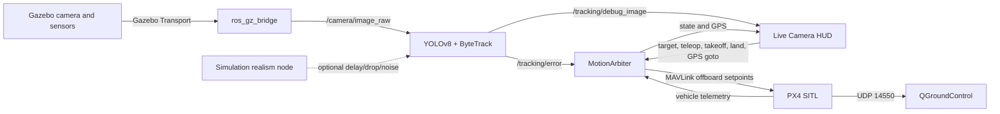

# UAV Vision Tracking & Autonomous Follower

Hệ thống mô phỏng drone tự động phát hiện, khóa và bám theo người trong thời
gian thực. Dự án kết hợp PX4 SITL, Gazebo Harmonic, ROS 2 Humble,
YOLOv8/ByteTrack, MAVLink và một bộ điều khiển state machine có hỗ trợ thao tác
thủ công từ Live Camera HUD.

> [!IMPORTANT]
> Dự án hiện ở giai đoạn nghiên cứu và kiểm thử SITL. Kết quả regression gần
> nhất đạt 3/5 kịch bản. Hệ thống chưa đủ điều kiện để triển khai bay thật nếu
> chưa hoàn thành toàn bộ safety gates trong [PROJECT_REPORT.md](PROJECT_REPORT.md).

## Mục lục

- [Tổng quan](#tổng-quan)
- [Kiến trúc hệ thống](#kiến-trúc-hệ-thống)
- [Cấu trúc repository](#cấu-trúc-repository)
- [Yêu cầu môi trường](#yêu-cầu-môi-trường)
- [Cài đặt](#cài-đặt)
- [Khởi chạy](#khởi-chạy)
- [Điều khiển Live HUD](#điều-khiển-live-hud)
- [ROS 2 interfaces](#ros-2-interfaces)
- [Kiểm thử và kết quả](#kiểm-thử-và-kết-quả)
- [Xử lý sự cố](#xử-lý-sự-cố)
- [An toàn và giới hạn](#an-toàn-và-giới-hạn)
- [Tài liệu dự án](#tài-liệu-dự-án)

## Tổng quan

### Mục tiêu

- Phát hiện người bằng YOLOv8n và duy trì ID bằng ByteTrack.
- Chuyển sai số ảnh thành lệnh vận tốc/yaw để drone bám mục tiêu.
- Duy trì độ cao, khoảng cách và hướng nhìn trong các tình huống tiến gần,
  đi xa, rẽ ngang hoặc quay đầu.
- Cho phép người vận hành giành quyền điều khiển tức thời bằng bàn phím.
- Cung cấp môi trường SITL lặp lại được để tái hiện luồng vận hành, lỗi và kiểm
  tra failsafe trước khi làm việc với phần cứng thật.

### Thành phần chính

| Thành phần | Vai trò |
| --- | --- |
| PX4 SITL | Flight controller, estimator, arming, takeoff, offboard và failsafe |
| Gazebo Harmonic | Mô phỏng vật lý, camera, cảm biến, drone và người đi bộ |
| ROS 2 Humble | Bus giao tiếp giữa camera, detector, HUD và bộ điều khiển |
| YOLOv8n + ByteTrack | Phát hiện người và theo dõi target ID |
| `motion_arbiter.py` | State machine và visual-servo flight control |
| `live_camera_hud.py` | Video, bounding box, GPS/minimap và teleoperation |
| QGroundControl | Giám sát PX4 qua MAVLink UDP 14550 trên Windows |

## Kiến trúc hệ thống



Luồng xử lý chính:

1. Gazebo tạo ảnh camera `640x480` và dữ liệu cảm biến.
2. `ros_gz_bridge` chuyển ảnh sang ROS 2 topic `/camera/image_raw`.
3. YOLO phát hiện lớp `person`, ByteTrack duy trì ID và tính sai số tâm/diện
   tích bounding box.
4. `MotionArbiter` chuyển sai số ảnh thành vận tốc thân drone, yaw rate và
   quyết định chuyển state.
5. PX4 nhận stream setpoint Offboard và điều khiển mô hình `x500_flow`.
6. HUD hiển thị video, trạng thái, GPS, FPS và nhận lệnh từ người vận hành.

Trong kiến trúc triển khai thật, drone truyền video tới server từ xa để suy luận;
server chỉ gửi `target_id` và trạng thái mục tiêu ở tần số thấp. Companion
computer trên drone vẫn chạy vòng `MotionArbiter` 10 Hz, gửi setpoint tới PX4 và
thực thi watchdog/failsafe cục bộ khi video hoặc liên kết server bị mất.

## Cấu trúc repository

```text
drone-project/
├── README.md                         # Hướng dẫn sử dụng nhanh
├── PROJECT_REPORT.md                 # Báo cáo dự án đầy đủ
├── start_stack.sh                    # Khởi chạy toàn bộ simulation stack
├── motion_arbiter.py                 # Flight state machine/control
├── live_camera_hud.py                # Live camera HUD và teleoperation
├── requirements.txt                  # Python dependencies
├── yolov8n.pt                        # YOLOv8 nano weights
├── gazebo/
│   ├── models/                       # x500 và pedestrian assets
│   └── worlds/                       # Các kịch bản tracking
├── ros2_ws/src/vision_tracking/
│   └── vision_tracking/
│       ├── yolo_detector_node.py     # Detector/tracker ROS 2 node
│       └── sim_realism_node.py       # Delay/drop/noise injection
├── simulation/                       # Realism, vehicle profile, failure tools
├── tests/px4/                        # SITL, MAVLink và regression tests
├── logs/                             # CSV/JSON/JSONL kết quả thử nghiệm
├── patches/                          # PX4 x500_flow GPS patch
└── scripts/                          # Setup và patch automation
```

## Yêu cầu môi trường

- Ubuntu 22.04 native hoặc WSL2 trên Windows 10/11.
- ROS 2 Humble Desktop.
- Gazebo Harmonic (`gz-sim8`) và `ros-humble-ros-gz-bridge`.
- Python 3.10 trở lên.
- PX4-Autopilot v1.14 đến v1.16.2 tại `../PX4-Autopilot` hoặc đường dẫn được
  chỉ định bởi `PX4_DIR`.
- QGroundControl trên Windows nếu cần theo dõi telemetry/GCS.

> Cấu hình CPU/GPU được dùng khi chạy local simulation chỉ là chi tiết của máy
> đang chạy đồng thời PX4 SITL/Gazebo và YOLO, không phải thuộc tính của hệ thống
> cuối cùng. Khi triển khai thật, drone truyền video tới companion/remote server
> để suy luận; năng lực tính toán phía server là mối quan tâm tách biệt và nằm
> ngoài phạm vi tài liệu này.

## Cài đặt

Clone dự án và chạy setup:

```bash
git clone https://github.com/PhamNguyenThanhTung/drone-project.git
cd drone-project
./scripts/setup_environment.sh
```

Script setup thực hiện:

1. Kiểm tra ROS 2 Humble.
2. Cài Python dependencies từ `requirements.txt`.
3. Áp dụng patch GPS cho PX4 airframe `4021_gz_x500_flow`.
4. Build package ROS 2 `vision_tracking` bằng `colcon`.
5. Kiểm tra hoặc tải model `yolov8n.pt`.

Thiết lập thủ công khi cần:

```bash
source /opt/ros/humble/setup.bash
pip3 install -r requirements.txt
./scripts/apply_px4_patch.sh --apply /path/to/PX4-Autopilot
cd ros2_ws
colcon build --symlink-install --packages-select vision_tracking
source install/setup.bash
```

Thiết bị suy luận và các cờ môi trường của phiên SITL được mô tả trong
`start_stack.sh`/tài liệu setup; chúng không đại diện cho kiến trúc triển khai
cuối cùng.

## Khởi chạy

### Chạy đầy đủ

```bash
./start_stack.sh
```

Mặc định hệ thống dùng:

- World: `person_tracking_path`
- Model: `x500_flow`
- Takeoff altitude: `3.8 m`
- HUD: bật
- QGroundControl auto-launch: tắt

Các tùy chọn world, realism, HUD và thiết bị chỉ là cờ của phiên mô phỏng; xem
`start_stack.sh` hoặc tài liệu setup khi cần thay đổi, thay vì coi chúng là
thành phần của luồng triển khai.

Nhấn `Ctrl-C` tại terminal chạy `start_stack.sh` để dừng toàn bộ process do
script tạo.

## Điều khiển Live HUD

| Phím/thao tác | Chức năng | State kết quả |
| --- | --- | --- |
| `TAB` hoặc `T` | Arm và takeoff | `STANDBY` sau khi đạt độ cao |
| `P` | Land | `STANDBY`/disarmed |
| Click vào người | Khóa target từ bounding box | `TRACKING` |
| `1` đến `9` | Khóa target ID | `TRACKING` |
| `0` hoặc `SPACE` | Hủy target, hover | `STANDBY` |
| `W` / `S` | Tiến / lùi | `MANUAL` |
| `A` / `D` | Trái / phải | `MANUAL` |
| `R` / `F` | Lên / xuống | `MANUAL` |
| `Q` / `E` | Yaw trái / phải | `MANUAL` |
| `X` | Dừng lệnh vận tốc | `MANUAL` |
| Click minimap | Gửi GPS position setpoint | `MANUAL_GOTO` |

## ROS 2 interfaces

| Topic | Kiểu message | Producer | Consumer |
| --- | --- | --- | --- |
| `/camera/image_raw` | `sensor_msgs/Image` | Gazebo bridge | YOLO detector |
| `/simulation/camera/image` | `sensor_msgs/Image` | Realism node | YOLO detector |
| `/tracking/debug_image` | `sensor_msgs/Image` | YOLO detector | Live HUD |
| `/tracking/error` | `geometry_msgs/Point` | YOLO detector | MotionArbiter |
| `/tracking/select_target` | `std_msgs/Int32` | HUD/detector | Detector/arbiter |
| `/tracking/click_point` | `geometry_msgs/Point` | HUD | Detector |
| `/teleop/cmd_vel` | `geometry_msgs/Twist` | HUD | MotionArbiter |
| `/teleop/flight_action` | `std_msgs/String` | HUD | MotionArbiter |
| `/tracking/goto_gps` | `geometry_msgs/Point` | HUD | MotionArbiter |
| `/tracking/motion_state` | `std_msgs/String` | MotionArbiter | HUD |
| `/tracking/gps` | `sensor_msgs/NavSatFix` | MotionArbiter | HUD |
| `/tracking/control_health` | `std_msgs/String` | MotionArbiter | GCS/Monitor |

## Kiểm thử và kết quả

### Regression 5 kịch bản

```bash
# Chạy đầy đủ SITL 5 kịch bản
python3 tests/px4/run_isolated_multi_trial.py

# Hoặc phân tích lại telemetry CSV hiện có với schema Stage 1 (không cần bật simulation)
python3 tests/px4/run_isolated_multi_trial.py --analyze-only
```

Kết quả được lưu dưới dạng relative paths và run metadata trong `logs/multi_trial_summary.json`, phân tách 3 lớp chỉ số (Perception, Control, Safety):

| Trial | Kịch bản | Alt Drop | Control | Track % | Perception | Safety | Status |
| ---: | --- | ---: | --- | ---: | --- | --- | --- |
| 1 | Nominal 180-degree turn | `0.085 m` | PASS | `10.6%` | FAIL | PASS | PASS |
| 2 | Fast 180-degree turn | `0.000 m` | PASS | `12.3%` | FAIL | PASS | PASS |
| 3 | Lateral left turn | `0.255 m` | FAIL | `24.3%` | WARN | PASS | FAIL |
| 4 | Lateral right turn | `0.000 m` | PASS | `32.1%` | WARN | PASS | PASS |
| 5 | Aggressive close-in | `0.187 m` | FAIL | `33.3%` | WARN | PASS | FAIL |

Kết luận: tầng Safety đạt độ tin cậy tuyệt đối (100% PASS, 0 lần rớt offboard/stall); tầng Control đạt 3/5 kịch bản; tầng Perception còn tracking retention thấp (`10.6%` - `33.3%`), là trọng tâm cần tối ưu trong Giai đoạn 2. Không được dùng bảng PASS như bằng chứng hệ thống đã sẵn sàng bay thật.

### Các test quan trọng khác

```bash
# Baseline arm/takeoff/offboard/land
python3 tests/px4/px4_baseline_test.py

# Kiểm tra camera -> YOLO -> /tracking/error
python3 tests/px4/test_approach_camera.py

# Kiểm tra quay đầu và ghi telemetry
python3 tests/px4/test_person_turnaround_live.py

# Kiểm tra đường dài nhiều góc rẽ
python3 tests/px4/test_long_path_tracking.py

# Tái hiện offboard-loss/autoland/takeoff recovery
python3 test_repro_autoland_and_takeoff.py
```

Đọc thêm hướng dẫn test tại [tests/px4/README.md](tests/px4/README.md).

## Xử lý sự cố

### HUD FPS thấp

FPS trên HUD là tốc độ ảnh đã đi qua camera, Gazebo, bridge, YOLO, debug render
và ROS 2; nó không chỉ là tốc độ inference. Kiểm tra từng đoạn:

```bash
ros2 topic hz /camera/image_raw
ros2 topic hz /tracking/debug_image
tail -f /tmp/yolo.log
```

Trong log YOLO, `mean_latency=0.033s` tương đương xấp xỉ 30 inference/s.
`det_rate` là tỷ lệ frame phát hiện được người, không phải FPS.

### Hai trial regression thất bại

Hai lần FAIL chủ yếu bắt nguồn từ logic trong `motion_arbiter.py`, không phải
hiệu năng suy luận: `vz` bị hard-code `0.0` nên không có phản hồi độ cao, phép
tính khoảng cách pinhole dùng hằng số độ cao lúc takeoff, còn các nhánh
`BACKING_UP_VISIBLE` và `BACKING_UP_TO_RECOVER` khóa `yaw_rate`/`vy` hoặc lùi mù
trong vài giây khi target mất hay rơi xuống nửa dưới khung hình. Camera bị rung,
IoU YOLO giảm về 0 và track bị mất vĩnh viễn. CUDA/WSL chỉ là một caveat môi
trường phụ cần ghi nhận khi tái hiện.

### Simulation chậm hoặc test thất bại ngẫu nhiên

- Dừng các instance `px4`, `gz sim`, detector hoặc HUD còn sót.
- Chạy test trên máy ít tải; wall-clock và simulation time có thể lệch khi CPU
  bị bão hòa.
- Khi cần cô lập control khỏi GUI, dùng chế độ headless được mô tả trong
  `start_stack.sh`.

### QGroundControl không kết nối

- Chạy QGC trực tiếp trên Windows.
- Kiểm tra UDP 14550 và `PX4_GCS_IP`.
- Đọc `/tmp/px4_gcs_mavlink.log` và `/tmp/px4_sim.log`.

## An toàn và giới hạn

> [!WARNING]
> Không dùng trực tiếp cấu hình SITL để bay ngoài trời. Không thử nghiệm với
> cánh quạt gắn trên drone nếu chưa hoàn thành HIL, bench test tháo cánh, dây
> neo/lồng bảo vệ, RC kill switch và geofence.

Các tham số như `COM_OF_LOSS_T`, `NAV_DLL_ACT`, `NAV_RCL_ACT`, tốc độ tiến/lùi
và vehicle dynamics phải được đo và cấu hình lại cho airframe thật. File
`simulation/vehicle_profile.yaml` vẫn chứa các trường `null` cần dữ liệu đo
thực tế.

## Tài liệu dự án

- [PROJECT_REPORT.md](PROJECT_REPORT.md): báo cáo đầy đủ để review/presentation.
- [simulation/README.md](simulation/README.md): realism, failure injection và
  safety ladder.
- [tests/px4/README.md](tests/px4/README.md): hướng dẫn test PX4/MAVLink.
- [logs/multi_trial_summary.json](logs/multi_trial_summary.json): kết quả
  regression gần nhất.
